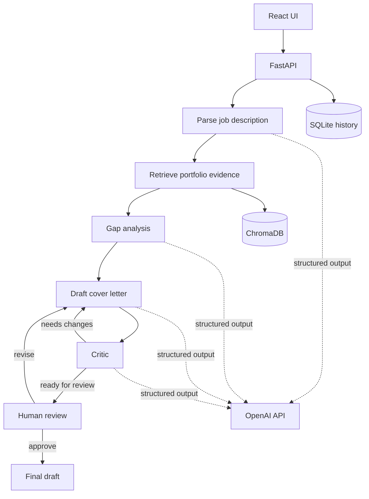
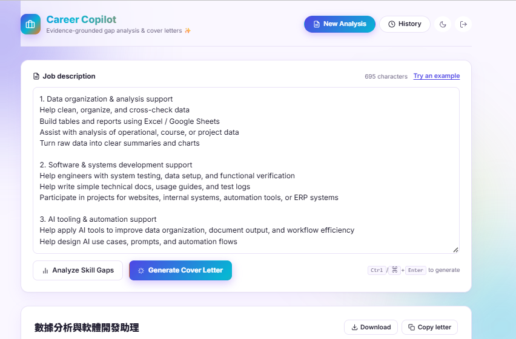
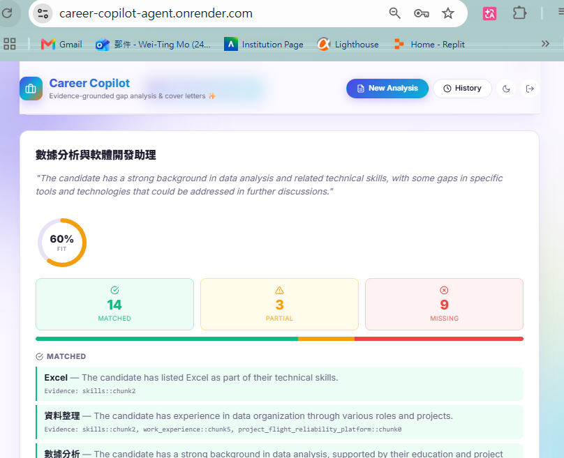
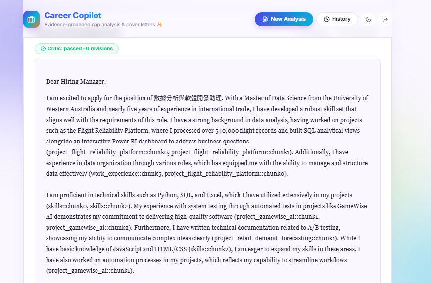
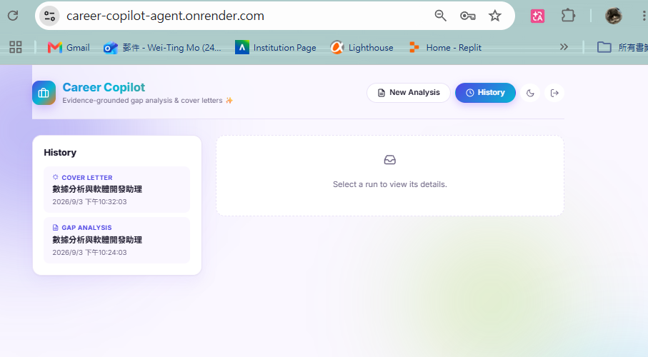

<div align="center">

# Career Copilot Agent

Job-gap analysis and cover-letter drafting using portfolio evidence, LangGraph, and human review.

[](https://github.com/momo840505/career-copilot-agent/actions/workflows/ci.yml)
[](https://career-copilot-agent.onrender.com)

</div>

## Why I built it

I wanted a project where an LLM had to stay tied to evidence instead of just producing a fluent answer.

The app takes a job description, breaks it into requirements, searches a small portfolio knowledge base, and marks each requirement as matched, partial, or missing. It can then draft a cover letter using the retrieved evidence.

The web drafting flow does not finish automatically. After the critic step, the draft pauses for a person to approve it or send it back for another revision.

The application does not submit job applications or send emails.

## How it works



There is also an MCP server with tools for evidence search, job analysis, and cover-letter drafting.

## Things I added after testing the first version

A few parts were added because the first working version was too easy to trust when it should not have been.

- Retrieval runs separately for each job requirement instead of doing one broad search for the whole JD.
- Weak retrieval matches can be dropped with a distance threshold.
- MMR re-ranking reduces near-duplicate evidence.
- Every parsed requirement has to appear exactly once in the gap report.
- A citation can only point to evidence retrieved for the same requirement.
- Rebuilding the index replaces the old Chroma collection so stale chunks are not left behind.
- Structured outputs are validated with Pydantic and only get a limited number of repair attempts.
- API/provider failures are handled separately from output-format repair retries.
- Factual sentences in the cover letter are checked against the draft's citation-backed claims.
- Review threads are tied to the browser client that created them.
- Request metrics use route templates instead of saving record IDs or review thread IDs in metric labels.

The requirement-coverage percentage shown in the UI is only a display score (`matched=1`, `partial=0.5`, `missing=0`). It is not a hiring probability.

## Evaluation

The repo has deterministic checks plus a small golden set of job descriptions.

The checks cover:

- citation validity;
- factual body/claim coverage;
- missing skills being incorrectly presented as experience;
- draft/critic revision behaviour;
- retrieval threshold behaviour;
- MMR selection;
- API, history, rate-limit, and review-thread behaviour.

There is also a separate LLM-as-judge groundedness check. I run repeated votes and report the spread as well as the median because I found that a single judge call can move between runs.

That judge score is informational. It is not used as the only pass/fail rule for the application.

## Main API routes

- `GET /health`
- `GET /metrics`
- `POST /auth/verify`
- `POST /gap-analysis`
- `POST /draft`
- `POST /draft/{thread_id}/decision`
- `GET /history`
- `GET /history/{record_id}`

The public demo uses a shared access code to reduce random API usage. It is only a demo gate, not a real user-account system.

History is scoped with a browser-generated client ID.

## MCP tools

The MCP server exposes:

- `search_evidence`
- `analyze_job_description`
- `draft_cover_letter`

Run it with:

```bash
mcp run src/career_copilot/mcp_server.py --transport streamable-http
```

## Run locally

PowerShell:

```powershell
python -m venv .venv
.\.venv\Scripts\Activate.ps1
python -m pip install -r requirements.txt
python -m pip install -e .
Copy-Item .env.example .env
python scripts/build_index.py
python -m pytest -m "not requires_api"
python scripts/run_api.py
```

Frontend:

```powershell
cd frontend
npm ci
npm run dev
```

## Docker

```bash
docker build -t career-copilot .
docker run --rm -p 8000:8000 --env-file .env career-copilot
```

The runtime image runs as a non-root user. Node is only used in the frontend build stage and is not kept in the final Python runtime image.

## Logs and metrics

The app records request status and latency plus structured-call information such as node name and retry state.

`/metrics` returns process-local totals. It does not include job-description text, access codes, client IDs, history record IDs, or review thread IDs.

## Screenshots

### Job description



### Gap analysis



### Cover-letter review



### History



## Current limitations

This is still a single-instance portfolio deployment.

- Review checkpoints are stored in memory, so an unfinished review session is lost if the server restarts.
- History uses SQLite.
- Request metrics are process-local.
- The shared access code is not a replacement for user authentication.
- The portfolio knowledge base is small and manually maintained.
- LLM output still depends on the external model provider, so deterministic validation is used where possible but cannot remove all model variability.

For a multi-user deployment I would move review checkpoints and history to durable storage, use real identity/authentication, use shared rate limiting, and send metrics to an external monitoring system.

See [SECURITY.md](SECURITY.md) for the current deployment boundary.
