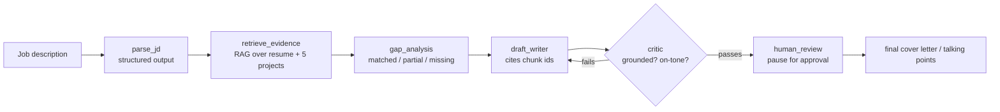

# Career Copilot Agent

A multi-agent job-application assistant that reads a job description, checks it against
my own resume + portfolio (via RAG), tells me honestly where I match and where I don't,
and drafts a grounded, citation-checked cover letter — with a human approval step before
anything goes out.

This is the 6th project in my data science / AI engineering portfolio. Where the other five
(`retail-demand-forecasting`, `cyber-risk-intelligence-lakehouse`, `gamewise-ai`,
`smart-hydro-alert`, `flight-reliability-platform`) cover classic ML, data engineering, NLP
retrieval, and IoT streaming, this one is deliberately an **agentic LLM system**: multi-step
planning, structured-output validation, self-correction loops, human-in-the-loop, evals for
generative output (not just accuracy metrics), and an MCP server — the pieces the other five
don't touch.

## Why this exists (skills gap it closes)

| Already demonstrated elsewhere | New in this project |
|---|---|
| ML pipelines, time-series forecasting | Multi-step **agent orchestration** (LangGraph state machine) |
| Semantic search (GameWise AI) | **RAG with enforced citations** + groundedness checking |
| FastAPI services, Docker, AWS deploys | **Structured output validation** (Pydantic + retry-on-failure) |
| Dashboards or CI for data pipelines | **Evals for generative output** (golden set, LLM-as-judge, CI gate) |
| — | **Human-in-the-loop** approval checkpoint |
| — | **MCP server** exposing the agent's tools to any MCP client |

## Architecture



## Build roadmap

- [x] Phase 0 — repo scaffold, environment
- [x] Phase 1 — RAG corpus (resume + 5 project write-ups) + retrieval
- [x] Phase 2 — `parse_jd` node with validated structured output
- [x] Phase 3 — `retrieve_evidence` + `gap_analysis` nodes
- [x] Phase 4a — `draft_writer` + `critic` nodes (manually chained, self-correction loop by hand)
- [x] Phase 4b — wired into an actual LangGraph `StateGraph` (conditional loop + `interrupt()` human-in-the-loop)
- [x] Phase 5 — eval harness (golden JD set, objective metrics + groundedness judge) + GitHub Actions CI
- [x] Phase 6 — FastAPI service + MCP server
- [ ] Phase 7 — Docker + cloud deploy + observability + final write-up

## Setup (Windows / PowerShell)

```powershell
cd career-copilot-agent
python -m venv .venv
.venv\Scripts\Activate.ps1
pip install -r requirements.txt
pip install -e .
copy .env.example .env
# then edit .env and paste your real OPENAI_API_KEY

# build the RAG index (needs your API key, costs a fraction of a cent)
python scripts/build_index.py

# smoke test: ask it something
python scripts/query_demo.py "does she have SQL and cloud deployment experience?"

# run the tests that don't need an API key
pytest -m "not requires_api"

# Phase 2: try the JD parser
python scripts/parse_jd_demo.py

# Phase 3: run the full parse -> retrieve -> gap-analysis chain
python scripts/pipeline_demo.py

# Phase 4a: draft_writer <-> critic self-correction loop (manual, pre-LangGraph)
python scripts/draft_and_critique_demo.py

# Phase 4b: the same pipeline as an actual LangGraph StateGraph, with a real
# human-in-the-loop pause (interrupt() / Command(resume=...)) before a letter
# is considered final
python scripts/graph_demo.py

# Phase 5: run the golden JD eval set (objective metrics + groundedness judge),
# needs an API key and costs a bit more (multiple JDs x multiple judge votes)
python scripts/run_evals.py

# Phase 6: run the pipeline as an HTTP service (FastAPI). Docs/try-it-out UI at
# http://127.0.0.1:8000/docs once it's running.
python scripts/run_api.py

# Phase 6: run the pipeline as an MCP server, so any MCP-aware client (Claude
# Desktop, an IDE, another agent) can call search_evidence / analyze_job_description /
# draft_cover_letter directly. This is the one to use day to day -- runs directly in
# your already-activated venv, no extra tooling needed:
mcp run src/career_copilot/mcp_server.py --transport streamable-http

# Optional: `mcp dev` opens an interactive inspector in the browser instead of just
# starting the server -- but unlike `mcp run` above, it launches the server through
# `uv run` (an isolated, reproducible throwaway environment, by the Inspector's own
# design), so it needs the `uv` tool installed separately first, and that throwaway
# environment won't have this project's other dependencies (langgraph, chromadb, ...)
# unless told to include them. Not verified end-to-end here -- `mcp run` above is the
# confirmed, day-to-day path; treat this one as a starting point to debug from if
# you want the interactive inspector specifically:
pip install uv
mcp dev src/career_copilot/mcp_server.py --with-editable .
```

> Tip: if your project folder path contains Chinese characters (e.g. under `Desktop\作品集\`),
> keep the **virtual environment itself** on an ASCII-only path if you hit any install errors —
> e.g. `python -m venv C:\venvs\career-copilot` and point your editor's interpreter at that,
> while the source code stays in your normal folder. Most tools handle Unicode paths fine now,
> but this is the first thing to try if `pip install` or `chromadb` complain.

## Evals (Phase 5)

`src/career_copilot/data/golden_jds/` holds 3 fixed job descriptions chosen to stress
different parts of the system: a strong-fit data-analyst role (expect mostly `matched`),
a deliberately weak-fit senior DevOps role (expect mostly `missing` — the honesty check),
and a mixed-fit role similar to the real JDs used during development. `scripts/run_evals.py`
runs each through the full pipeline (via `graph/pipeline.py`, the non-interactive version
of the graph — no human in the loop, so it can run unattended in CI) and reports two kinds
of check, deliberately kept separate:

- **Hard gates** (`career_copilot/eval/metrics.py`) — objective, code-based, deterministic:
  citation validity, no undisclaimed mention of a missing skill, and whether the
  writer/critic loop converged within `MAX_REVISIONS`. A failing run fails the build.
- **Groundedness judge** (`career_copilot/eval/groundedness_judge.py`) — an LLM-as-judge
  score, asked `n_votes` times per draft rather than once, reporting the median *and* the
  spread across votes. This is where the "LLM-as-judge noise" limitation flagged back in
  Phase 4 gets addressed rather than just noted — informational only, not a hard gate,
  because a single noisy number shouldn't block a merge.

`.github/workflows/ci.yml` runs `pytest -m "not requires_api"` on every push/PR (free, no
secret needed), and a separate `eval-gate` job runs the real golden-set eval — gated to
pushes to `main`, manual dispatch, or a weekly schedule, so it never burns API cost on
every commit or runs (uselessly, without a secret) on an external PR.

To let `eval-gate` actually run in your own fork/repo, set, under **Settings → Secrets
and variables → Actions**: `OPENAI_API_KEY` as a repository **Secret** (required), and
optionally `OPENAI_CHAT_MODEL` / `OPENAI_CRITIC_MODEL` as repository **Variables** if you
want CI to use the same model choices as your local `.env` — `ci.yml` falls back to
`gpt-4o-mini` / `gpt-4o` respectively if you don't set them, matching `.env.example`'s
own recommendation. See the matching engineering note below for why that fallback
exists — it's not a hypothetical.

### Known limitations, and why this is by design

No LLM-based system — this one included — can guarantee it never makes a questionable
call on a brand-new input; a "100% success rate" claim for a system like this would be a
red flag, not a selling point. What this project actually promises, and what the eval
harness exists to check honestly rather than paper over, is narrower and more defensible:
**nothing wrong ever reaches a human unflagged.** Every structured-output call goes
through `invoke_structured`'s validate-and-retry loop; if every attempt still fails, the
pipeline stops cleanly with a `StructuredOutputError` and a clear message — it never
silently ships a fabricated citation, an item double-classified in a gap report, or an
overclaimed skill. `gap_analysis`'s retry budget was widened from 2 to 4 once the golden
set showed its failure mode scales with how many requirements a JD packs in (more
requirements = more independent chances for a same-report conflict); that's a bounded,
evidence-driven adjustment, deliberately not an open-ended chase to prompt-engineer away
every edge case a future JD might introduce, which has no actual finish line. See the
"Phase 5" entries in the engineering notes below for the specific failures this surfaced
and how each was reasoned through.

In practice, on the 3-JD golden set: the widened `gap_analysis` budget is not
theoretical — one confirmation run needed all 5 attempts (4 identical "STUCK" repeats
before finally breaking out) to converge on a JD that would have failed outright under
the old budget of 3. The densest JD (~10 requirements, thin evidence coverage) still
occasionally exhausts `draft_writer`'s retry budget and fails — cleanly, with a clear
`StructuredOutputError` and no bad citation ever shipped. That's the accepted, expected
shape of "safe failure" this section describes, not a bug still being chased.

## API & MCP server (Phase 6)

Two thin entry points over the same pipeline everything else in this project calls —
neither duplicates any pipeline logic, they just expose it differently.

**FastAPI service** (`src/career_copilot/api/app.py`, launched via
`python scripts/run_api.py`): `GET /health` (no LLM call — confirms the service is up
and an API key is configured), `POST /gap-analysis` (parse -> retrieve -> gap analysis),
and `POST /draft` (the full pipeline, draft/critic loop included — no human-in-the-loop
approval over HTTP, unlike `graph_demo.py`'s interactive run; the caller is expected to
check `critic_passed` / `critic_issues` before using the draft for anything, per the
"Known limitations" section above). A `StructuredOutputError` — every repair attempt in
`invoke_structured`'s retry loop exhausted — is mapped to `502 Bad Gateway`, not
`400/422`: the request itself was fine, an upstream dependency (the LLM) is what failed
to deliver. Interactive docs at `/docs` once it's running.

**MCP server** (`src/career_copilot/mcp_server.py`): exposes `search_evidence`,
`analyze_job_description`, and `draft_cover_letter` as MCP tools, so any MCP-aware
client (Claude Desktop, an IDE, another agent) can call this pipeline directly with no
HTTP client of its own. Run it with `mcp run src/career_copilot/mcp_server.py
--transport streamable-http` — confirmed live, runs directly in the same venv
everything else in this project uses, no extra tooling required. `mcp dev` (the
interactive browser inspector) is a separate, optional path with its own `uv`
dependency — see the setup section above and the engineering note below. Built against
the `mcp[cli]` **v2.x** API (`from mcp.server import MCPServer`); see the other
engineering note below for why that's pinned explicitly rather than left as
`mcp>=1.0.0`.

## Tech stack

Python, LangGraph, LangChain, OpenAI API, ChromaDB, Pydantic, FastAPI, MCP, Docker,
GitHub Actions, pytest.

## Engineering notes / bugs caught during development

Keeping a running log here — this is exactly the kind of "I broke it, here's how I found
it and fixed it" material that makes for a strong interview story (see the target-leakage
catch on `cyber-risk-intelligence-lakehouse` for the same idea applied to an ML pipeline).

- **Phase 3 — self-contradictory gap classification.** On the very first real JD run, the
  model classified the same requirement (e.g. "技術文件撰寫") as **both** `matched` and
  `missing` in the same report. Nothing in the schema forbade it — Pydantic validators only
  see one field/item at a time, not the relationship between three separate lists. Fixed by
  adding `check_no_duplicate_requirements()`, a whole-report check wired into the same
  `invoke_structured(..., validate=...)` retry loop already used for the hallucinated-citation
  check. Caught by actually running the pipeline against a real JD, not by unit tests alone —
  the unit tests were added *after*, to lock the fix in (`tests/test_gap_duplicate_check.py`).

- **Phase 4 — LLM-as-judge noise, and a stateless writer.** Running
  `draft_and_critique_demo.py` against a real JD surfaced two separate reliability problems in
  the self-correction loop: (1) the critic's verdict on the *same* sentence was inconsistent
  across separate calls (flagged, then not flagged, then flagged again) — a known
  characteristic of LLM-as-judge systems, not something code alone fixes (Phase 5's eval
  harness exists partly to quantify and manage this); (2) the writer only ever saw the *latest*
  round of critic feedback, so a problem fixed in attempt 1 (generic filler) could silently
  reappear in attempt 3 once the critic's most recent verdict happened not to repeat it — the
  writer had no memory of its own revision history. Fixed #2 directly: `draft_writer` now takes
  the full accumulated feedback history across all attempts, not just the newest verdict. #1 is
  mitigated, not solved — a separately-configurable `OPENAI_CRITIC_MODEL` (a stronger judge
  tends to be less noisy) and, longer-term, majority-vote / multi-judge calibration in Phase 5.

- **Phase 4 — the retry loop never showed the model its own previous answer.** A deeper bug
  than the two above: `invoke_structured`'s repair loop rebuilt every retry from the *original*
  prompt plus an abstract error description — the model never saw the JSON it had actually
  produced. So a "fix this" retry wasn't a targeted edit, it was a blind re-roll with a hint,
  and the same class of mistake (a duplicated requirement) could resurface on a *different* item
  each attempt. Fixed by echoing the model's previous (schema-valid but rule-violating) output
  back as an `AIMessage` before the error feedback, so retries become genuine edits. Verified
  with a scripted fake-LLM test (no API key needed) that the retry message sequence actually
  contains the prior output before shipping it — this affects all four nodes, since they all
  share `invoke_structured`.

- **Phase 4 — don't make the model do lookups it can be handed pre-joined.** Even with the
  above fixed, the critic still flagged 100% of claims as "ungrounded" across three straight
  attempts, unrelated to how much the draft actually improved. Root cause: the critic was shown
  two separately-shaped lists — claims with `chunk_id` references, and a flat evidence list
  keyed by `chunk_id` — and asked to cross-reference them itself. It effectively gave up and
  defaulted to "flag everything." Fixed by doing the join in code: each claim is now shown with
  its own cited evidence text directly beneath it, so the model only has to make one judgment
  (does *this* text support *this* claim?) instead of a lookup plus a judgment. General lesson:
  when an LLM step behaves suspiciously uniformly regardless of input, suspect the *input
  format* before assuming the model or the prompt wording is at fault.

- **Phase 4 — a correct catch that still couldn't be fixed, because the flag carried no
  reason.** With the previous bug fixed, the critic started giving genuinely accurate feedback
  — e.g. correctly catching that "I have utilized Excel extensively... in various projects"
  overclaims evidence that only lists Excel as one tool among several. But `draft_writer`
  couldn't act on it: the same overclaim (barely reworded) reappeared nearly verbatim across
  all 3 attempts. Root cause: `CriticVerdict.ungrounded_claims` was `list[str]` — just the
  flagged sentence's own text, echoing back what the writer already wrote, with no explanation
  of *why* it was rejected. The writer could only guess at what to change. Fixed by restructuring
  it into a list of `UngroundedClaim{claim_text, reason}` (the same `(item, note)` shape already
  used by `GapItem` in `gap_analysis`), and updating the critic's prompt to require a specific,
  actionable reason per flag. General lesson, paired with the one above: getting an LLM step's
  *judgment* right isn't enough if the *shape of the feedback it returns* can't actually drive a
  fix downstream — the consumer of a verdict matters as much as the verdict itself.

- **Phase 4 — reworded, not fixed: the writer kept swapping one unsupported qualifier for
  another.** With reasons now attached, the critic's feedback on the same Excel claim was
  specific and correct across all 3 attempts (its only evidence, `skills::chunk2`, is a bare tool
  name in a list — no detail on how much or how well it was used). But the writer's 3 rewrites
  were "used it extensively for data manipulation and visualization" → "used it as part of my
  data analysis work" → "allows me to handle various data tasks effectively": three different
  unsupported qualifiers, never zero. The writer had no concept of "this evidence is too thin to
  support ANY elaboration — the fix is to say less, not say it differently." Fixed by adding an
  explicit rule to `draft_writer`'s prompt: match claim strength to evidence specificity — a bare
  mention (a name in a list, no elaboration) earns only a bare claim ("I have used Excel"), never
  a strength word ("extensively", "proficient", "effectively") unless a *different* cited chunk
  actually describes the scope or outcome of that use. General lesson: when a self-correction
  loop keeps "fixing" the same flaw with a same-strength synonym, the model isn't missing the
  *feedback* — it's missing the *concept* that the right move is subtraction, not rephrasing.
  With this fix, the loop converged in 2 attempts on the same real JD that previously never
  converged in 3 — confirmed against live output, not just the unit tests.

- **Phase 4b — the `interrupt()` re-run gotcha.** Wiring `human_review` into the actual
  `StateGraph` surfaced a non-obvious LangGraph behavior worth flagging explicitly rather than
  discovering it the hard way: when a graph resumes after `interrupt()`, the node function that
  called it **reruns from the top** — every line before the `interrupt()` call executes again,
  not just the lines after it. For `human_review` that's harmless (it only reads existing state
  before pausing), but it's exactly the kind of thing that would silently double-fire a real side
  effect — an email send, a paid API call, a DB write — placed before `interrupt()` in a node
  that later gets resumed. Documented directly in `_node_human_review`'s docstring as a rule: any
  side effect in an interruptible node belongs strictly *after* the `interrupt()` call.

- **Phase 4b — the checkpointer was silently pickling our own classes.** The first live run of
  `graph_demo.py` printed six `"Deserializing unregistered type ... this will be blocked in a
  future version"` warnings — one per custom class stored in `AgentState`
  (`JDRequirements`, `RetrievedChunk`, `EvidenceBundle`, `GapReport`, `CoverLetterDraft`,
  `CriticVerdict`). Looked it up rather than ignoring a "just a warning": LangGraph's checkpoint
  format can reconstruct arbitrary Python objects from msgpack unless the allowed types are
  restricted, which is exactly the shape of a real, disclosed vulnerability
  ([GHSA-g48c-2wqr-h844](https://github.com/langchain-ai/langgraph/security/advisories/GHSA-g48c-2wqr-h844))
  — a compromised checkpoint store becomes a code-execution vector, not just a data leak. Our
  own state only ever holds our own trusted classes, so the actual risk here is low, but the
  fix is one line either way: construct the checkpointer with an explicit
  `allowed_msgpack_modules` allow-list (`JsonPlusSerializer(allowed_msgpack_modules=[...])`
  passed into `InMemorySaver(serde=...)`) instead of leaving it on the permissive default. General
  lesson: a "this will be blocked in a future version" log line is the library telling you a
  default is about to change under you — worth 10 minutes to fix now, on my own schedule,
  instead of on a future `pip install --upgrade` day. Confirmed fixed on the next live run — the
  warnings are gone.

- **Phase 4b — the writer invented a placeholder chunk_id, and the safety net actually caught
  it.** Same live run surfaced a genuinely new failure: for the "missing" requirement
  (企業流程自動化), `draft_writer` tried to write an honest bridging sentence ("I have
  streamlined workflows in my previous roles...") but had no real evidence chunk that actually
  supports that specific sentence — so instead of dropping the claim, it invented a fake
  `chunk_id` (first an empty string, then `"_"`) to satisfy the schema's "every claim needs a
  citation" rule. `check_claims_cite_real_evidence` — the same outside-the-schema validator from
  Phase 4a that catches hallucinated citations — caught both attempts immediately and fed the
  error back; the model got it right on the 3rd try (a real `work_experience` chunk instead).
  **The end-to-end system did exactly what it's supposed to do here** — a bad citation never
  reached the human — but it burned 2 of 3 retries doing it, which is a real cost (latency, token
  spend, and it eats into the retry budget `gap_analysis`/`critic` might also need). Root cause:
  the prompt's rule for "missing" items said a "strong partial" could be "honestly bridged," but
  didn't say what to cite when bridging, and didn't forbid inventing a placeholder outright.
  Tightened both: a `claims` entry now must cite a real chunk for the *related* skill it's
  bridging FROM, never the missing skill itself, and never a placeholder — and if no real chunk
  supports a sentence, it doesn't become a `claims` entry at all. General lesson, and arguably the
  most reassuring one in this log: layered defenses are meant to be redundant. The prompt should
  ideally have prevented this on the first try, and now prompts closer to that — but the
  validate-and-retry safety net built in Phase 2 is what actually made the failure invisible to
  the end user while that prompt gap still existed. That's the point of defense in depth.

- **Phase 4b — the stronger-worded rule only halved the problem; removing the input killed it.**
  Re-ran the same JD after the rule tightened above: it helped (1 failed attempt instead of 2,
  and the model chose to drop the unsupportable sentence entirely rather than invent a citation
  for it), but it still reached for a placeholder `"_"` on its first try, both times. A prompt
  telling a model "don't do X" is a probabilistic nudge, not a guarantee — no amount of stronger
  wording gets that to zero, because the model was still being shown the thing that tempted it:
  the "missing" item's name, and gap_analysis's `suggested_talking_points` (which in earlier runs
  had already been observed bridging language for non-partial items too — see above). The actual
  fix: stop showing `draft_writer` the "missing" list and `suggested_talking_points` at all.
  `_format_gap_report` now returns only "matched" and "partial" items, each with its own real
  evidence — there is structurally nothing left to invent a citation for, because there's nothing
  shown that doesn't already have one. Nothing about honesty is lost: the full gap report
  (missing items included) still reaches the human reviewer through `human_review`'s payload; the
  letter's job was never to enumerate every gap, only to make the honest case for what's there.
  General lesson, and the cleanest version of one that keeps recurring in this log: when a model
  keeps misusing a piece of input despite being told not to, the more reliable fix is usually to
  stop handing it that input, not to word the instruction more forcefully. Confirmed clean on the
  next live run — no more placeholder-citation retries.

- **Phase 5 — closing the loop on "LLM-as-judge noise" from Phase 4.** Back in Phase 4, the
  critic's inconsistent verdicts on the same sentence were noted as a known limitation, "not
  something code alone fixes... Phase 5's eval harness exists partly to quantify and manage
  this." `groundedness_judge.py` is that follow-through: instead of trusting a single LLM-as-judge
  call, it asks the same question `n_votes` times and reports the *spread* across votes alongside
  the median score — a tight cluster means the judge's opinion is probably real, a wide spread
  means today's single score would have been noise. Deliberately kept separate from the objective,
  code-based checks in `metrics.py` (citation validity, missing-skill leaks, convergence), which
  ARE treated as hard CI gates precisely because they're deterministic — the groundedness score
  stays informational, never a hard gate, because a metric this noisy shouldn't be trusted to
  single-handedly fail a build.

- **Phase 5 — the eval set immediately did its job: it broke on a JD I'd never manually tried.**
  Every prior live bug in this log was found against the same one or two JDs I kept re-pasting by
  hand. The very first `run_evals.py` run, against 3 JDs specifically chosen to be *different*
  from those, hit two hard failures: `gap_analysis` classified "樞紐分析" into two buckets on
  **all 3/3 attempts, with the byte-identical error every time**; separately, `draft_writer`
  invented the placeholder chunk_id `"_"` on **all 3/3 attempts**, also byte-identical — the same
  symptom the Phase 4b fixes above were supposed to have closed, on a JD that happened to hit a
  different "partial" item with thin evidence. This is exactly the point of a golden set: a
  single hand-picked JD tests one path through the system, repeatedly; a small deliberately-varied
  set finds the paths that path never touched.

- **Phase 5 — the deeper bug under both failures: retries were stuck, not just wrong.** Both
  failures above share a root cause that's more fundamental than either individual prompt issue:
  `parse_jd`/`gap_analysis`/`critic` all run at `temperature=0.0` (see `llm.py`) for
  reproducibility, but `invoke_structured`'s repair message is itself deterministic — same error
  text in, same wording out. Feed a temperature-0 model the identical follow-up prompt twice and
  it can regenerate the identical (wrong) answer, which is exactly what happened: not 3 different
  failed attempts at a fix, but the same non-fix repeated 3 times, burning the entire retry budget
  for zero benefit. (`draft_writer` runs at 0.3, not 0.0, and still repeated identically — low
  temperature narrows the odds without needing to hit zero.) Fixed in `invoke_structured` itself,
  so every node gets it at once: each attempt's error is compared to the previous attempt's: on a
  byte-identical repeat, the next attempt's prompt gets an explicit "you're stuck, make a
  genuinely different decision" note, AND that attempt runs at a bumped temperature (0.7) via
  `llm.model_copy(update={"temperature": 0.7})` — deliberately *not* `llm.bind(temperature=...)`,
  which chains through a `RunnableBinding` wrapper with real, documented bugs interacting with
  `with_structured_output` (langchain-ai/langchain#23167, #35320) that could silently drop the
  override; `model_copy` sidesteps that whole risk by working on a plain field, not the Runnable
  composition machinery. Locked in with `tests/test_invoke_structured_retry.py` — a fake, scripted
  LLM asserts the exact temperature sequence across attempts, both for the stuck case (escalates)
  and the normal case (never does), without needing a real API key. General lesson: a retry loop
  that always resends "the same kind of nudge" isn't actually retrying — it's repeating; a retry
  loop needs the ability to recognize when IT'S the one stuck, not just the model.

- **Phase 5 — the test written to lock in the fix above had its own bug.** The very first run of
  `test_invoke_structured_retry.py` failed 2/5 tests — not because the fix was wrong (the captured
  log lines showed `invoke_structured` correctly detecting "STUCK — repeats previous error" right
  where expected), but because the fake `_FakeLLM.model_copy()` used in the test hard-coded
  `return _FakeLLM(...)` instead of `return type(self)(...)`. Real Pydantic's `model_copy()`
  preserves the concrete subclass of whatever it's copying; this fake didn't, so the escalated
  attempt's `TrackingLLM` subclass silently downgraded to a plain untracked `_FakeLLM` on copy, and
  the test's own instrumentation missed calls it should have seen — an under-verified assumption
  in a fake standing in for real behavior, not a flaw in the thing being tested. Also caught, while
  fixing that: the test's assumption that `with_structured_output` gets rebuilt every attempt was
  wrong too — the real code reuses one pre-built client for every non-escalated attempt and only
  rebuilds it for an escalated one, so the correct expected call sequence is `[0.0, 0.7]` (build
  once, then once more on escalation), not one entry per attempt. Both fixed directly in the fake
  and the assertions. Small, on-brand lesson to end on: a test that fails doesn't automatically
  mean the code under test is wrong — verify which side of the assertion the bug is actually on
  before "fixing" the wrong one.

- **Phase 5 — one requirement stayed stuck even at the bumped temperature: noise wasn't the whole
  story.** Re-ran the golden set after the stuck-retry fix: JD03's placeholder-citation failure was
  gone (self-corrected in 1 attempt this time, where it had previously exhausted all 3), but JD01
  hit a NEW instance of the duplicate-bucket bug — "樞紐分析" (pivot tables) — and this time even
  the temperature-0.7 escalated attempt reproduced the identical error a 3rd time. That's a useful
  negative result: it means this particular confusion isn't pure sampling noise that a bit of
  temperature can shake loose — the model has a stable (if wrong) reason for wanting to put a
  narrow sub-skill in two buckets, and no amount of re-rolling fixes a stable reasoning error.
  Root cause: the JD asked for "Excel 樞紐分析" (Excel pivot tables) as its own requirement, but
  the evidence only supports general "Excel" experience without naming pivot tables specifically —
  exactly the "sub-skill nested under a broader matched skill" case, and `gap_analysis`'s prompt
  had no tie-breaking rule for it (the same category of gap `draft_writer` had for claim strength
  back in Phase 4a, just never carried over to this node). Fixed with an explicit, ordered
  tie-breaker: a sub-skill with no evidence of its own but real evidence for its broader
  tool/domain is "partial" — never "matched" (that overclaims the specific technique) and never
  "missing" (that discards real, relevant signal). General lesson to close Phase 5 on: the
  stuck-retry fix and this one are complementary, not redundant — one recovers from a random slip,
  the other prevents a systematic misjudgment; a system needs both, and neither substitutes for
  the other.

- **Phase 5 — where this line of debugging stops, and why stopping here is the right call, not a
  shortcut.** One more golden-set run after the tie-breaker fix: JD01 now converged cleanly (2
  revisions, all hard gates pass), but JD03 — the densest JD, ~10 parsed requirements — hit yet
  another duplicate-bucket conflict, this time on 3-4 items at once, and exhausted its retries.
  Diagnosed the actual pattern behind all of Phase 5's failures: they cluster on `gap_analysis`
  specifically, and specifically scale with how many requirements a JD has — more requirements
  means more independent chances for at least one classification conflict, and clearing several
  conflicts in the same report is a harder combinatorial problem than clearing one. The fix here
  is deliberately NOT another prompt patch chasing this run's specific offending items (that's
  the pattern this whole section has been following, and every fix so far has found a new edge
  case rather than reaching zero) — it's widening `gap_analysis`'s own `invoke_structured` retry
  budget from 2 to 4, sized to the actual problem (more surface area needs more attempts), while
  every other node keeps the default. This is where Phase 5 stops, on purpose: chasing full
  determinism on every possible JD has no finish line for an LLM-based system, and isn't actually
  the right goal — see "Known limitations" above for what the actual goal is instead, and why a
  system that sometimes needs a retry (and says so clearly when it does) is a stronger, more
  honest result than a claim of zero failures ever would be.

- **Phase 6 — an unpinned dependency almost repeated the exact mistake the LangGraph checkpoint
  advisory had already taught this project to avoid.** `requirements.txt` had `mcp>=1.0.0` sitting
  in it since the very first scaffold, unpinned "because it hadn't been needed yet." Before
  writing `mcp_server.py` against it, I checked the actual current API rather than trusting a
  remembered tutorial — and the SDK had made a breaking change between v1.x
  (`from mcp.server.fastmcp import FastMCP`) and v2.x (`from mcp.server import MCPServer`, the
  class itself renamed), released alongside the "2026-07-28 MCP specification". An unpinned
  `pip install -r requirements.txt` run today would have silently picked up v2, and code written
  against a v1.x tutorial (the only kind that existed when this project's requirements file was
  first scaffolded) would have failed at import time with no clue why beyond an `ImportError`.
  This is the same category of bug the LangGraph checkpoint serializer advisory caught back in
  Phase 4b, just at dependency-resolution time instead of runtime: an unpinned or under-specified
  dependency isn't a convenience, it's a silently deferred break waiting for whoever installs
  next. Fixed by pinning `mcp[cli]>=2,<3` with an explanatory comment, and writing `mcp_server.py`
  against the verified current v2 README rather than assumption.

- **Phase 6 — `scripts/run_api.py` deliberately breaks from every other script's import
  pattern.** Every other script in `scripts/` starts with `sys.path.insert(0, ...)` to make
  `career_copilot` importable without an editable install. Tracing through how `uvicorn --reload`
  actually works before writing this script caught why that pattern would silently fail here
  specifically: `--reload` runs the real server in a **separate subprocess** that re-imports the
  string app target (`"career_copilot.api.app:app"`) fresh — a `sys.path.insert()` done in the
  parent process that launches uvicorn simply isn't visible to that subprocess, so the reloader
  would hit `ModuleNotFoundError` the instant a file changed and it respawned. `run_api.py`
  relies on the project's already-established `pip install -e .` editable install instead, which
  makes `career_copilot` importable from any process, no path patching required. A one-line
  difference from the other scripts, caught by reasoning through the tool's actual process model
  before running it rather than after debugging a reload-only failure live.

- **Phase 6 — my own em dash broke `pip install -r requirements.txt` on Windows.** The very
  first live run of the Phase 6 changes failed immediately, before any package even resolved:
  `UnicodeDecodeError: 'cp950' codec can't decode byte 0xe2 in position 759`. `pip`'s requirements-file
  parser has no way to know a `.txt` file's encoding (no BOM, no `# -*- coding -*-` cookie — that's
  a Python source-file convention, not a `pip` one) and falls back to the OS's locale-preferred
  encoding when it can't detect one; on Windows with a Traditional Chinese system locale, that's
  `cp950` (Big5), not UTF-8. The explanatory comment I'd written for the `mcp[cli]` pin used a
  literal em dash (`—`, `U+2014`) — 3 UTF-8 bytes, byte 0 of which (`0xe2`) is not a valid `cp950`
  lead byte on its own, hence the crash at that exact byte offset. Every other file in this repo
  (`pyproject.toml`, `.env.example`, all `.py` sources) is pure ASCII or, for `.py` files, read
  under Python's own UTF-8-by-default source encoding — `requirements.txt` was the one place an
  em dash could actually reach a codec that isn't UTF-8-aware. Confirmed by scanning every
  pip/build-adjacent config file in the repo for bytes above 0x7F: `requirements.txt` was the only
  offender, and the one non-ASCII byte sequence in it was exactly this em dash. Fixed by replacing
  it with a plain hyphen — general lesson: a comment that reads fine in an editor can still be a
  landmine for whichever tool reads the file next with a different, non-UTF-8 fallback encoding;
  `requirements.txt`/`.cfg`/`.ini`-style config files (anything without an explicit encoding
  declaration mechanism) are worth keeping strictly ASCII, not just "looks like plain text."

- **Phase 6 — `mcp dev` and `mcp run` are not the same execution model, and only one of them was
  actually needed here.** First live attempt at the MCP server used `mcp dev
  src/career_copilot/mcp_server.py`, which opens an interactive browser Inspector — it opened fine,
  but the server itself showed **Failed / Connection closed**, with the Inspector's own "Servers"
  panel revealing the actual command it was trying to run: `uv run --with mcp==2.1.1 mcp run
  src/career_copilot/mcp_server.py`. Running that exact command by hand (bypassing the Inspector's
  UI, which was also garbling the console output — a separate, likely display-layer encoding issue
  on top of the real one) gave a plain, readable answer: `uv` — a separate Python packaging tool —
  wasn't installed at all. `mcp dev` launches the Inspector's target server through `uv run` by
  design, to test against a clean, reproducible throwaway environment rather than whatever's
  already active in the caller's shell; it needs `uv` installed as a prerequisite, and that
  throwaway environment starts with only `mcp` in it, not this project's other dependencies. `mcp
  run` — the command actually documented for real client use, not just interactive debugging — has
  no such requirement: it ran directly in the already-fully-set-up project venv on the first try,
  no `uv` needed. Since `mcp run` is what a real MCP client (Claude Desktop, an IDE, another agent)
  actually uses, and it was confirmed working end-to-end, this is where Phase 6's MCP verification
  stopped — `mcp dev`/Inspector is documented as an optional, not-fully-verified extra for anyone
  who specifically wants the interactive debugging UI, rather than chased to full certainty for a
  path that isn't actually load-bearing. Same "verify the thing that matters, don't chase every
  side path to zero" judgment call as the retry-budget decision back in Phase 5.

- **Phase 6 — the FastAPI service, live-tested end to end, is where all of Phase 4/5's fixes paid
  off at once.** A real ~9-requirement "Software Engineer" JD (SQL, Git, Docker, RESTful APIs,
  Java, Spring Framework, Kubernetes, AWS, Microservices) run through both `/gap-analysis` and
  `/draft` via the `/docs` UI came back clean on the first live request: every citation traced to a
  real chunk_id, every "partial" gap (Java, Spring Framework, Kubernetes, Microservices) was
  honestly bridged rather than overclaimed or invented, `critic_passed: true` after exactly one
  revision. A separate request on what looks like the same JD did hit a `{'Docker': 2}`
  duplicate-bucket conflict on its first `invoke_structured` attempt — and self-corrected within
  the same request, returning `200 OK` with no trace of the conflict in the response. That's not a
  contradiction with the "known limitations" section above; it's the expected shape of the exact
  thing that section describes: the same underlying model behavior sometimes needs a retry and
  sometimes doesn't, and the system's job was never to eliminate that variance, only to make sure a
  client calling this API only ever sees a fully-resolved report or a clean `502`, never a
  half-fixed one. Confirmed live, on real (not scripted) input, that both outcomes hold.

- **Phase 6 — going live on GitHub Actions surfaced a config-drift bug the local dev loop could
  never have caught.** First real `eval-gate` run (after finally getting `OPENAI_API_KEY` into the
  repo's Actions secrets — an earlier attempt failed because the secret had been named `API_KEY`,
  not `OPENAI_API_KEY`, a plain typo caught immediately from the same `RuntimeError` message
  `get_collection` already raises for a missing key) got past that, actually called the real API —
  and then failed `critic_converged` on **all 3** golden JDs at once, every one stuck at
  `revision_count == max_revisions + 1` (fully exhausted, never satisfied). Uniform failure across
  every JD, on a gate that had converged locally before, pointed away from "the model just had a
  bad run" and toward a systematic difference between the two environments. It was: local `.env`
  sets `OPENAI_CRITIC_MODEL=gpt-4o` (`.env.example` says why — plain `gpt-4o-mini` "can be
  over-strict" as a critic), but the CI workflow only ever passed through `OPENAI_API_KEY`, so
  `eval-gate` was silently running the critic on the stricter default the whole time. Not a bug in
  the pipeline itself — every hard gate did exactly its job, correctly failing a run whose critic
  genuinely never passed — but a bug in what CI was actually testing: it wasn't exercising the same
  configuration this project is actually meant to run with. Fixed two ways at once: `ci.yml` now
  passes `OPENAI_CHAT_MODEL`/`OPENAI_CRITIC_MODEL` through as repository Variables, AND falls back
  to the `.env.example`-recommended values (`gpt-4o-mini` / `gpt-4o`) via `${{ vars.X || 'default'
  }}` if those Variables are never set — so a forgotten config step degrades to the *documented*
  default behavior, not a silently stricter one nobody chose. General lesson, and a fitting one to
  end this project's CI setup on: `.env` being gitignored (correctly, since it holds the API key)
  means every *other* variable in it needs a deliberate, explicit decision about whether CI should
  mirror it — "add the secret" is not the same task as "make CI match local," and this project
  found out the difference the hard way, on the very first real run.

- **Phase 7 — two "fixed" failures came back on `eval-gate`, and this time the fix went one layer
  deeper.** First `eval-gate` run after pushing the Phase 7 frontend/Docker/Render work failed two
  golden JDs — and both failures were symptoms this log already claimed were closed. (1)
  `01_strong_fit_data_analyst.txt`: `gap_analysis` classified a requirement into two buckets, the
  exact Phase 3 bug `check_no_duplicate_requirements` was built to catch — except this time the
  retry loop never converged. Attempts 2-4 were byte-identical STUCK repeats (Phase 5's bumped-
  temperature escalation kicked in as designed), but attempt 5, now genuinely different, just moved
  the same conflict onto a *different* requirement (`資料倉儲設計經驗`) instead of resolving it. All
  5 retries spent, still duplicated — Phase 5's fix (break the determinism) worked exactly as
  intended and it still wasn't enough, because breaking a stuck loop guarantees a *different*
  answer, not a *correct* one. (2) `03_mixed_fit_ops_automation.txt`: `draft_writer` invented the
  placeholder chunk_id `"_"` again — the Phase 4b/5 failure that `_format_gap_report` was supposed
  to have structurally prevented by only ever showing the writer matched/partial items, each with
  its own real evidence. It still had a hole: nothing actually *required* a matched/partial item to
  carry real evidence in the first place — `check_matched_and_partial_have_evidence` didn't exist
  yet, so a `partial` item with an empty `evidence_chunk_ids` list (a valid gap_analysis output the
  schema never forbade) sailed straight through and handed `draft_writer` exactly the "nothing to
  cite" situation Phase 4b's fix assumed could no longer happen.
  Both fixes this time are structural rather than another round of stronger wording or more
  retries: `gap_analysis.py`'s duplicate-bucket check was rewritten from raise-and-retry into
  `dedupe_requirements`, which resolves the conflict deterministically (`partial` > `matched` >
  `missing` — see its docstring for why that order is the honest one) instead of spending more LLM
  calls hoping one attempt lands cleanly; and the new `check_matched_and_partial_have_evidence`
  closes the actual hole Phase 4b's fix depended on without enforcing. Also fixed one level further
  upstream: `parse_jd`'s prompt was silently splitting an "X 或 Y" JD bullet (e.g. "系統測試或自動化
  測試經驗") into two separate near-duplicate requirements, which is exactly the kind of pair
  `gap_analysis` tends to get confused between — told it to keep interchangeable alternatives as one
  requirement instead. General lesson, and maybe the most important one in this whole log: a fix
  that "confirmed clean on the next live run" was tested against the JD that broke it, not against
  the space of JDs that could. A golden set that runs on every push is what turned "seems fixed" into
  "still broken, on a case I hadn't tried" — automatically, unattended, weeks after the original fix
  — instead of leaving it to be rediscovered by a real user.
