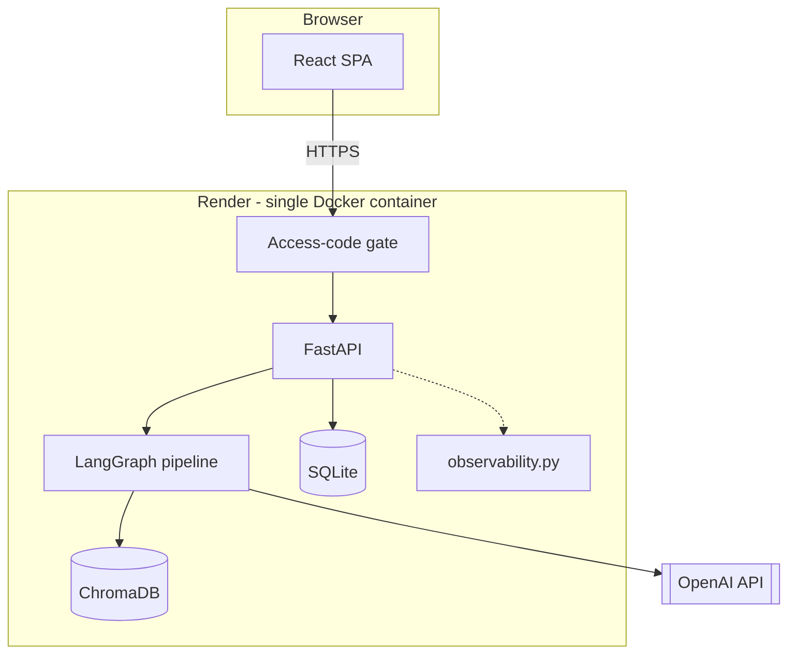
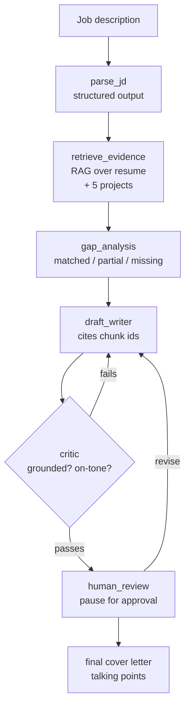

<div align="center">

# 💼 Career Copilot Agent

### An AI agent that checks my resume against a job description and drafts a cover letter — with a human approval step before anything goes out


[](https://github.com/momo840505/career-copilot-agent/actions/workflows/ci.yml)
[](https://career-copilot-agent.onrender.com)


[Overview](#-overview) •
[Live Demo](#-live-demo) •
[Architecture](#️-architecture) •
[Setup](#️-setup) •
[Evals](#-evals) •
[API and MCP Server](#-api-and-mcp-server) •
[Deployment](#-deployment) •
[What I Learned Building This](#-what-i-learned-building-this)

</div>

---

## 📌 Table of Contents

- [Overview](#-overview)
- [Live Demo](#-live-demo)
- [Architecture](#️-architecture)
- [Setup](#️-setup)
- [Evals](#-evals)
- [API and MCP Server](#-api-and-mcp-server)
- [Deployment](#-deployment)
- [Observability](#-observability)
- [Tech Stack](#-tech-stack)
- [What I Learned Building This](#-what-i-learned-building-this)
- [Skills Demonstrated](#-skills-demonstrated)

---

# 🚀 Overview

This is the 6th project in my data science / AI engineering portfolio, and the one I'm
proudest of. My other five projects (`retail-demand-forecasting`,
`cyber-risk-intelligence-lakehouse`, `gamewise-ai`, `smart-hydro-alert`,
`flight-reliability-platform`) cover classic ML, data engineering, NLP, and IoT
streaming. This one is different on purpose: it's an **agentic LLM system** — multi-step
planning, structured output that gets validated and retried, a self-correction loop, a
human-in-the-loop pause, real evals for generative output (not just accuracy metrics),
an MCP server, a React frontend, and a live Docker deployment.

The idea: paste in a job description, and the agent reads through my actual resume and
project write-ups, tells me honestly what matches and what doesn't (no inflating the
gaps away), and drafts a cover letter that only makes claims it can back up with a real
citation.

---

# 🌐 Live Demo

### [🧭 Open Career Copilot Agent](https://career-copilot-agent.onrender.com)

Paste in a real job description and watch it run against my actual resume and project
write-ups — gap analysis first, then a cover letter with a critic verdict attached.

> **Heads up on free-tier hosting:** Render spins the instance down after 15 minutes of
> no traffic, so the first request after a while can take 30–60 seconds to wake up —
> if it times out, just retry once it's warm. It's also gated behind a shared access
> code, mostly so a random visitor can't run up my OpenAI bill — message me if you
> want a demo login.

### Job description input


### Gap analysis — fit score, matched / partial / missing, with evidence citations


### Cover letter — self-correction loop passed on the first attempt


### History — every run is saved per access-code client


---

# 🏗️ Architecture

### System overview (frontend, API, deployment)



The React frontend talks to FastAPI over HTTPS with an access code on every route
except `/health` and `/metrics`. FastAPI hands the actual work off to the LangGraph
pipeline, which pulls context from ChromaDB and calls OpenAI for every reasoning step.
Every successful run gets saved to SQLite so it shows up in the history tab.
`observability.py` (dotted line — logging only, not a request path) just watches
everything and exposes it at `/metrics`.

### Agent pipeline (inside the LangGraph node)



Parse the JD into structured requirements, pull the resume/project chunks that
actually support each one, figure out what's matched vs. missing, write a draft that
cites its sources, and have a separate "critic" step check the draft before a human
ever sees it. If the critic isn't happy, it goes back to the writer (capped at a few
tries). Once it passes, a real person has to approve it before it's considered final —
and can send it back for another round with feedback if it's not quite right.

---

# ⚙️ Setup

```powershell
cd career-copilot-agent
python -m venv .venv
.venv\Scripts\Activate.ps1
pip install -r requirements.txt
pip install -e .
copy .env.example .env
# then edit .env and paste your real OPENAI_API_KEY

# build the RAG index (needs your API key, costs a fraction of a cent)
python scripts/build_index.py

# smoke test: ask it something
python scripts/query_demo.py "does she have SQL and cloud deployment experience?"

# run the tests that don't need an API key
pytest -m "not requires_api"

# try the JD parser on its own
python scripts/parse_jd_demo.py

# run the full parse -> retrieve -> gap-analysis chain
python scripts/pipeline_demo.py

# the draft_writer <-> critic loop, before it was wired into LangGraph
python scripts/draft_and_critique_demo.py

# the same pipeline as an actual LangGraph StateGraph, with a real
# human-in-the-loop pause before a letter counts as final
python scripts/graph_demo.py

# run the golden JD eval set (needs an API key, costs a bit more since
# it's multiple JDs x multiple judge votes)
python scripts/run_evals.py

# run the pipeline as an HTTP service — docs/try-it-out UI at
# http://127.0.0.1:8000/docs once it's running
python scripts/run_api.py

# run it as an MCP server instead, so Claude Desktop / an IDE / another
# agent can call search_evidence / analyze_job_description / draft_cover_letter
# directly — this is the one I actually use day to day
mcp run src/career_copilot/mcp_server.py --transport streamable-http

# build and run the same Docker image the live deployment uses
docker build -t career-copilot .
docker run --rm -p 8000:8000 --env-file .env career-copilot
```

> If your project folder path has Chinese characters in it (mine does — under
> `Desktop\作品集\`), keep the **virtual environment itself** on a plain
> ASCII-only path if `pip install` or anything with a console-script `.exe`
> starts throwing weird "Unable to create process" errors — e.g.
> `python -m venv C:\venvs\career-copilot`. The source code is fine staying
> wherever it is; it's specifically the generated Windows launcher `.exe`s
> (pytest, uvicorn, ruff...) that choke on non-ASCII paths.

---

# 🧪 Evals

`src/career_copilot/data/golden_jds/` has 3 fixed job descriptions picked to stress
different parts of the system: a strong-fit data-analyst role, a deliberately
weak-fit senior DevOps role (this is the "does it stay honest" check), and a
mixed-fit role closer to what I actually tested against while building this.
`scripts/run_evals.py` runs each one through the full pipeline and checks two
different things, kept deliberately separate:

- **Hard gates** (`career_copilot/eval/metrics.py`) — deterministic, code-based:
  every citation is real, nothing claims a skill that's actually missing, and the
  writer/critic loop actually converged. If any of these fail, the build fails.
- **A groundedness score** (`career_copilot/eval/groundedness_judge.py`) — an
  LLM-as-judge, asked the same question several times per draft instead of once,
  so I can see the spread across votes and not just trust a single noisy number.
  This is informational, not a hard gate — a metric this noisy shouldn't be able
  to fail a build by itself.

`.github/workflows/ci.yml` runs the free unit tests on every push, and a separate
`eval-gate` job runs the real (paid) golden-set eval on pushes to `main`, manual
runs, or a weekly schedule — so it's not burning API cost on every commit or trying
to run (uselessly, with no secret available) on an external PR.

## ⚠️ Known Limitations, by Design

No LLM system can promise it'll never make a weird call on a brand-new input — I'd be
suspicious of any project claiming a 100% success rate. What this one actually
promises is narrower: **nothing wrong reaches a human unflagged.** Every
structured-output call goes through a validate-and-retry loop, and if every attempt
still fails, it stops cleanly with a clear error instead of silently shipping a
fabricated citation or an overclaimed skill. On the densest test JD (~10
requirements, thin evidence), it does sometimes exhaust its retry budget and fail —
cleanly, with no bad citation ever getting through. That's the intended shape of
"failing safely," not a bug I'm still chasing.

---

# 🔌 API and MCP Server

Two thin entry points over the same pipeline everything else calls — neither
duplicates the actual logic, they just expose it differently.

**FastAPI service** (`src/career_copilot/api/app.py`): `GET /health`, `GET /metrics`,
`POST /gap-analysis`, and `POST /draft` / `POST /draft/{thread_id}/decision` for the
full draft/critic/human-review flow. `POST /draft` always comes back
`pending_review` with a `thread_id` — it never hands back a finished letter on its
own. The caller reviews it and calls the decision endpoint with `approve` or
`revise` (with feedback) to send it back for another pass. A `StructuredOutputError`
(every retry exhausted) maps to `502`, since that's an upstream (the LLM) failure,
not a bad request. Docs at `/docs` once it's running.

**MCP server** (`src/career_copilot/mcp_server.py`): exposes `search_evidence`,
`analyze_job_description`, and `draft_cover_letter` as MCP tools, so anything that
speaks MCP (Claude Desktop, an IDE, another agent) can call this pipeline directly.
Run with `mcp run src/career_copilot/mcp_server.py --transport streamable-http`.

---

# 🐳 Deployment

The live demo runs from a single Docker image with both the frontend and backend
baked in — no separate hosting for either.

**Multi-stage `Dockerfile`:** stage 1 builds the React frontend, stage 2 is the
Python backend, which serves the built frontend as static files. One container, one
port, same-origin frontend and API — no CORS headaches in production.

**`docker/entrypoint.sh`:** rebuilds the Chroma RAG index on boot (Render's free
tier gives you an ephemeral filesystem, so nothing built at image-build time
survives a restart) — but skips the rebuild if an index is already on disk, so it's
not re-paying OpenAI embedding costs every time it restarts for no reason.

**`render.yaml`:** a committed Render Blueprint — this is genuinely how the live
deployment is configured, not just a screenshot of a dashboard nobody else can see.
`OPENAI_API_KEY` and `ACCESS_CODE` are marked `sync: false` so Render asks for them
in its own dashboard instead of them ever sitting in this public repo.

**Being upfront about the free tier:** the instance spins down after 15 minutes idle
and takes 30–60 seconds to wake back up. That's a deliberate trade-off for a
$0/month personal project, not something I'm hiding.

---

# 📈 Observability

Two small pieces in `src/career_copilot/observability.py`: structured (JSON, in the
Docker image) logging for every request and every LLM call, and a `GET /metrics`
endpoint with in-memory counters — no database, no external service, since this is a
single-instance deployment and that's genuinely all it needs. It answers the two
questions I actually care about when something looks off: is the API taking traffic
and erroring, and is the LLM pipeline healthy or burning through retries. Left
ungated (like `/health`) since it only exposes aggregate counts, nothing tied to a
specific person's data. Live at
**[career-copilot-agent.onrender.com/metrics](https://career-copilot-agent.onrender.com/metrics)**.

---

# 🧰 Tech Stack

**Agent orchestration / LLM engineering:** LangGraph (`StateGraph`, conditional
edges, `interrupt()`), LangChain (`with_structured_output`), OpenAI API, Pydantic
(structured-output schemas with validate-and-retry).

**RAG and retrieval:** ChromaDB, chunked resume + 5 project write-ups as the
corpus, enforced citation checking (no chunk id, no claim).

**API and frontend:** FastAPI, React 18 + Vite (hand-rolled inline SVG icons, no
icon library), MCP server, SQLite for history.

**DevOps:** Docker (multi-stage build), Render (Blueprint deploy), GitHub Actions
(unit tests every push, golden-set eval-gate on `main`).

**Testing:** pytest with a fake-LLM harness for retry-loop logic (no API key
needed), a 3-JD golden eval set with both hard gates and an LLM-as-judge score.

---

# 📝 What I Learned Building This

This isn't a "look, no bugs" project — I kept a running log while building it because
the debugging process is honestly the more interesting part of the story. A few of
the ones I'd actually bring up in an interview:

- **The model classified the same requirement as both matched and missing at once**,
  and nothing stopped it, because Pydantic checks one field at a time, not the
  relationship between three lists. Fixed by adding a whole-report check that runs
  through the same retry loop.

- **The writer only ever saw the critic's latest feedback**, so a problem fixed in
  attempt 1 could silently come back in attempt 3. Also found the retry loop never
  showed the model its own previous (wrong) answer, just an abstract error — so a
  "fix this" retry was really a blind re-roll with a hint, not an actual edit. Fixed
  both: full feedback history gets passed in, and the model's prior output gets
  echoed back before the correction.

- **The critic flagged 100% of claims as "ungrounded" for three attempts straight**,
  completely unrelated to how good the draft actually was. Turned out it was being
  handed two separately-shaped lists and asked to cross-reference them itself — it
  basically gave up and flagged everything. Doing that join in code instead of asking
  the model to do it fixed it immediately. General lesson I keep coming back to:
  when a step behaves suspiciously uniformly no matter the input, check the input
  shape before blaming the prompt.

- **The writer kept inventing a fake citation (`"_"`) instead of dropping an
  unsupportable claim.** The validator that's supposed to catch hallucinated
  citations did catch it every time, so nothing bad ever reached a human — but it
  burned retries doing it. Root cause: the prompt never said what to cite when there
  wasn't a real chunk to cite. Eventually just stopped showing the writer the
  "missing" items at all, since there was nothing left to invent a citation for once
  it couldn't see them.

- **A LangGraph `interrupt()` gotcha that would've been nasty in production:** when a
  paused node resumes, the whole node function reruns from the top, not just the
  code after the interrupt. Harmless here since the human-review node only reads
  state before pausing, but a real side effect (an email, a paid call, a DB write)
  placed before `interrupt()` would silently double-fire on every resume.

- **The checkpointer was silently allowed to deserialize arbitrary Python objects**
  by default — a real, disclosed LangGraph security advisory
  ([GHSA-g48c-2wqr-h844](https://github.com/langchain-ai/langgraph/security/advisories/GHSA-g48c-2wqr-h844)).
  One line to lock it down to an explicit allow-list of my own trusted classes.

- **CI failed a gate that had passed locally, on every single golden JD at once.**
  Uniform failure across every JD pointed at an environment difference, not a bad
  model run — and it was: my local `.env` used a stronger (less strict) critic
  model than CI's default, because CI was never told to use it. Fixed by passing
  the model choice through as a CI variable with a sensible fallback, so a forgotten
  config step degrades to the documented default instead of a silently stricter one.

- **My own em dash broke `pip install` on Windows.** A `UnicodeDecodeError` from
  `cp950` (Big5) trying to decode a literal `—` in a comment inside
  `requirements.txt` — pip has no way to know that file's encoding and falls back
  to the OS locale, which on a Traditional Chinese Windows setup isn't UTF-8. Now I
  keep that file strictly ASCII.

- **A duplicate-bucket bug kept resurfacing even after three separate fixes**, each
  one closing the exact case that broke it last time but not the next JD that hit a
  slightly different version of it. Eventually stopped trying to prompt-engineer it
  away entirely and made the classifier deterministically resolve the conflict in
  code instead of retrying and hoping. Same fix pattern reused for a very similar
  bug in the evidence-requirement check later on — once I recognized the shape
  ("the model keeps confidently repeating the same wrong call"), the fix was
  obvious the second time.

---

# 🎯 Skills Demonstrated

**Agentic AI / LLM engineering:** multi-step orchestration with LangGraph,
structured-output validation with self-healing retries, a writer/critic
self-correction loop, human-in-the-loop approval via `interrupt()`, prompt
decisions backed by actual debugging rather than guesswork.

**RAG and retrieval:** vector-store-backed retrieval over a real chunked corpus,
anti-hallucination citation enforcement, evidence formatting designed to shape what
a downstream LLM step can and can't get away with.

**Evals for generative AI:** a golden-JD set covering strong/weak/mixed fit on
purpose, deterministic hard gates alongside a spread-aware LLM-as-judge score, a CI
gate that's actually caught real regressions automatically.

**Software engineering and APIs:** FastAPI service design (error mapping,
dependency injection, same-origin static hosting), an MCP server exposing the same
pipeline as agent tools, a React + Vite SPA, SQLite-backed history with an
access-code auth gate and per-IP rate limiting.

**DevOps and deployment:** multi-stage Docker builds, Blueprint-based cloud
deployment with committed config, structured JSON logging and an in-process
`/metrics` endpoint sized to the actual deployment, and root-causing real
production symptoms from logs instead of guessing.
