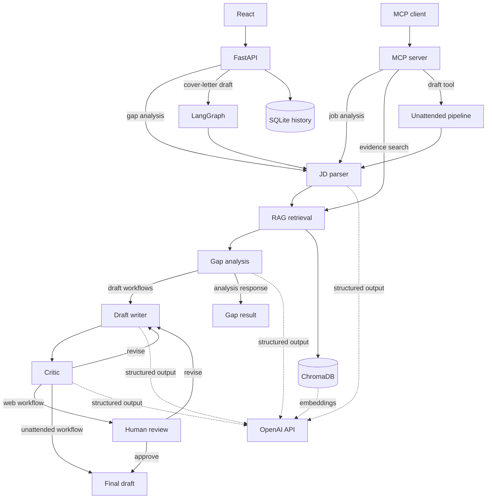

<div align="center">

# Career Copilot Agent

Evidence-grounded job gap analysis and cover-letter drafting with LangGraph, RAG,
human review, and automated evaluation.

[](https://github.com/momo840505/career-copilot-agent/actions/workflows/ci.yml)
[](https://career-copilot-agent.onrender.com)

</div>

## Overview

Career Copilot compares a job description with a structured portfolio knowledge base.
It retrieves evidence for each requirement, classifies the requirement as matched,
partial, or missing, and can draft a cover letter using retrieved evidence.

The drafting workflow includes a critic pass and a human approval checkpoint. The
application does not submit emails or job applications.

## Architecture



`POST /gap-analysis` stops after the gap result. `POST /draft` uses the LangGraph
human-review path, while the MCP draft tool uses the unattended pipeline.

## Reliability controls

- Retrieval runs independently for each job requirement.
- MMR re-ranking reduces duplicate evidence.
- A configurable distance threshold allows retrieval to return no evidence for weak
  matches.
- Every parsed requirement must appear exactly once in the gap report.
- Citations are checked against evidence retrieved for the same requirement.
- Rebuilding the index replaces the Chroma collection to remove stale vectors.
- Structured outputs use Pydantic validation and bounded repair retries.
- Provider/API failures are separate from structured-output repair retries.
- Factual cover-letter sentences must be represented in the citation-backed claim list.
- Human review is implemented with a LangGraph interrupt.
- Review threads are tied to the browser client that created them.
- Request metrics use route templates rather than raw record or thread IDs.
- The UI requirement-coverage percentage is a presentation heuristic (`matched=1`, `partial=0.5`, `missing=0`), not a hiring or acceptance probability.

## Evaluation

The repository combines deterministic checks with a golden job-description suite.

Hard checks cover:

- citation validity
- factual body/claim coverage
- missing-skill leakage
- critic convergence

Groundedness is scored separately with repeated judge votes and is reported as an
informational metric.

## API

Main endpoints:

- `GET /health`
- `GET /metrics`
- `POST /auth/verify`
- `POST /gap-analysis`
- `POST /draft`
- `POST /draft/{thread_id}/decision`
- `GET /history`
- `GET /history/{record_id}`

The deployed demo uses a shared access code to limit public API usage. It is a demo
gate rather than a user-account system. History is scoped with a browser-generated
client ID.

## MCP

The MCP server exposes:

- `search_evidence`
- `analyze_job_description`
- `draft_cover_letter`

Run it with:

```bash
mcp run src/career_copilot/mcp_server.py --transport streamable-http
```

## Local setup

PowerShell:

```powershell
python -m venv .venv
.\.venv\Scripts\Activate.ps1
python -m pip install -r requirements.txt
python -m pip install -e .
Copy-Item .env.example .env
python scripts/build_index.py
python -m pytest -m "not requires_api"
python scripts/run_api.py
```

Frontend:

```powershell
cd frontend
npm ci
npm run dev
```

## Docker

```bash
docker build -t career-copilot .
docker run --rm -p 8000:8000 --env-file .env career-copilot
```

The Docker build uses separate Node and Python build stages. The runtime image does
not include Node or build-essential and runs as a non-root user.

## Observability

Requests and structured LLM calls are logged with route, status, latency, node, attempt
count, and retry state. `/metrics` exposes process-local aggregates and does not include
job descriptions, access codes, client IDs, record IDs, or review thread IDs.

## Screenshots

### Job description


### Gap analysis


### Cover letter review


### History


## Limitations

This is a single-instance portfolio deployment. SQLite history, in-memory LangGraph
checkpoints, and process-local metrics do not provide multi-instance durability. A
production multi-user deployment would use durable identity, persistent checkpoints,
a managed database, centralized rate limiting, and external metrics storage.

See [SECURITY.md](SECURITY.md) for the deployment security boundary.
